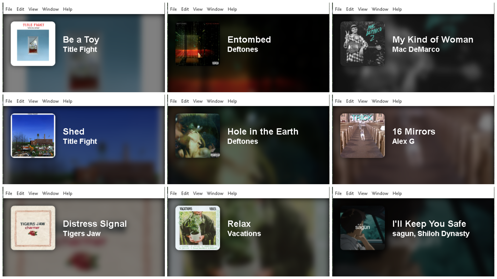

# Spotify Music Visualizer

A sleek **desktop music visualizer** built with **Electron** that displays your currently playing Spotify track with a beautiful **artist image background**, album cover, and song information.  

## Screenshots

  
 
---

# Setup and Installing

1. **Clone this repository:**

```bash
git clone https://github.com/LagBack/spotify-music-visualizer.git
cd spotify-music-visualizer
```

2. **Install dependencies**

```bash
npm install
```

3. **Create a Spotify Developer App:**

*(*😔*This is required due to spotify no longer allowing production mode for small individual developers) **“As of May 15 2025, Spotify only accepts applications only from organisations (not individuals)” for extended quota."***
- Go to [Spotify Developer Dashboard](https://developer.spotify.com/dashboard)  
- Click **“Create an App”**  
- Add a Redirect URI: http://127.0.0.1:8888/callback
- Copy your **Client ID** and **Client Secret**

- **Create a .env file** in the project root and add:
```bash
SPOTIFY_CLIENT_ID=your_client_id_here
SPOTIFY_CLIENT_SECRET=your_client_secret_here
```

5. **Start the app**
```bash 
npm start
```


